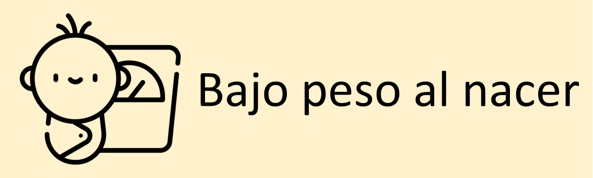

<style>
@import url('https://fonts.googleapis.com/css2?family=Roboto+Mono&family=Roboto+Slab&family=Source+Sans+Pro:wght@300;400&display=swap');
</style>

```{r setup, include=FALSE}
# Attach packages:

library(learnr)
library(fontawesome)

# Global code chunk settings:
knitr::opts_chunk$set(echo = FALSE)

# Cargando datos

load("data/nac.rdata")
```

## 1. Introducción

```{r, echo=FALSE, out.width="100%", fig.align = "center"}
  
```

<a rel="license" href="http://creativecommons.org/licenses/by-nc-sa/4.0/"></a><br />Este obra está bajo una <a rel="license" href="http://creativecommons.org/licenses/by-nc-sa/4.0/">licencia de Creative Commons Reconocimiento-NoComercial-CompartirIgual 4.0 Internacional</a>.

Numerosos estudios en el mundo han investigado los factores asociados con el bajo peso al nacer en diferentes poblaciones; lo más probable es que una combinación de factores biológicos, comportamentales, ambientales y médicos contribuya al peso al nacer de un bebé.


Este taller tiene como objetivo introducir el análisis de datos empleando el programa estadístico [R](https://cran.r-project.org/); para este fin emplearemos la información recolectada sobre una muestra de nacimientos simples observados en el condado de King (Washington, USA)

```{r, echo=FALSE, out.width="50%", fig.align = "center"}
  
```

### ¿Cómo desarrollar este tutorial?

A lo largo del tutorial, encontrará ejemplos de código, ejercicios de programación y preguntas de de análisis. Los ejemplos de código y los ejercicios suponen un conocimiento básico de R, funciones, argumentos y el operador de tuberías. No es necesario tener conocimientos previos sobre R para el desarrollo de este tutorial.

#### `r fa("fas fa-robot", fill = "orange")` = Código de ejemplo
Aquí tienes una versión reescrita del texto: El ícono del robot de ayuda señala los ejemplos de código a lo largo del tutorial. Estos ejemplos incluyen código preescrito y funcional que puedes explorar y ejecutar al presionar el botón "Run code" en la esquina superior derecha.

No te preocupes, **no hay forma de dañar el código de ejemplo**. Si realizas cambios en alguno de los ejemplos y recibes un mensaje de error, simplemente haz clic en "Comenzar de nuevo" en la esquina superior izquierda, y el código se restablecerá automáticamente a su configuración predeterminada.


#### `r fa("fas fa-keyboard", fill = "orange")` = Ejercicios de código

El ícono del teclado señala ejercicios de práctica en los que deberás ingresar el código manualmente para obtener los resultados que  solucionen las preguntas planteadas. Si te encuentras atascado, simplemente haz clic en el botón 'Solution' o 'Hint'.


#### `r fa("brain", fill = "orange")` = Preguntas de análisis

El ícono del cerebro señala preguntas que debes reflexionar y responder. En algunos casos, no existe una respuesta correcta o incorrecta; puede haber múltiples respuestas válidas. Muchas de estas preguntas de reflexión estarán relacionadas con un ejemplo o ejercicio de codificación. En esos casos, asegúrate de ejecutar el código correspondiente para poder ver la salida necesaria que te ayude a responder las preguntas.


**NOTE:** *Si desea profundizar en el manejo del programa R y planea emplearlo de forma frecuente se recomienda instalarlo en su computador 💻, esto le permitirá trabajar sin conexión a la internet y emplear un mayor conjunto de herramientas. Para más información consulte este [material](https://github.com/introbios/R-Rstudio). También puede consultar en el Departamento de Epidemiología Clínica y Bioestadística por el __Semillero de bioestadística__*


## 2. Cargando y explorando los datos

##### `r fa("fas fa-robot", fill = "orange")` Leyendo los datos

Cargando los datos

```{r n_miss_kp, exercise = TRUE}
load("data/nac.rdata")
```


##### `r fa("fas fa-robot", fill = "orange")` Explorando el archivo de datos

```{r e3, exercise = TRUE}
str(nac)
```


## 3. Estadísticas descriptivas

##### `r fa("fas fa-keyboard", fill = "orange")` Explorando el archivo de datos

Cree una tabla para el sexo

```{r w1, warning = FALSE, exercise = TRUE}

```

## 4. Tablas estadísticas

## 5. Gráficos

### Exercise with Hint

*Here's an exercise where the chunk is pre-evaluated via the `exercise.eval` option (so the user can see the default output we'd like them to customize). We also add a "hint" to the correct solution via the chunk immediate below labeled `print-limit-hint`.*

Modify the following code to limit the number of rows printed to 5:

```{r print-limit, exercise=TRUE, exercise.eval=TRUE}
mtcars
```

```{r print-limit-hint}
head(mtcars)
```

### Quiz

*You can include any number of single or multiple choice questions as a quiz. Use the `question` function to define a question and the `quiz` function for grouping multiple questions together.*

Some questions to verify that you understand the purposes of various base and recommended R packages:

```{r quiz}
quiz(
  question("Which package contains functions for installing other R packages?",
    answer("base"),
    answer("tools"),
    answer("utils", correct = TRUE),
    answer("codetools")
  ),
  question("Which of the R packages listed below are used to create plots?",
    answer("lattice", correct = TRUE),
    answer("tools"),
    answer("stats"),
    answer("grid", correct = TRUE)
  )
)
```
